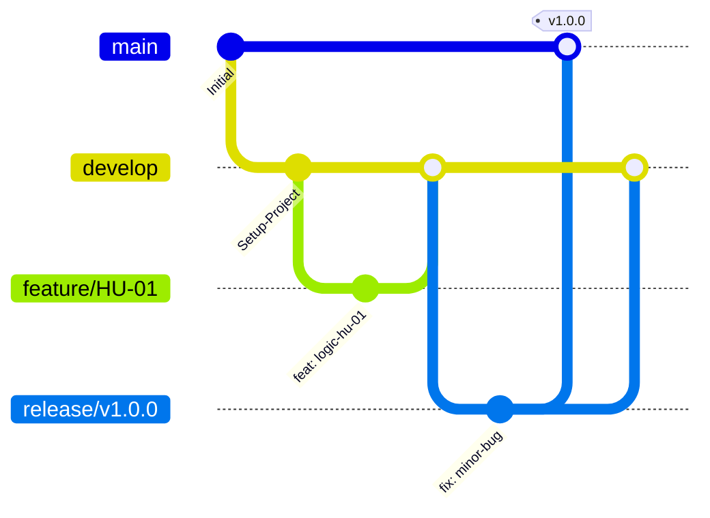

# AgroValle Connect


## Visión del Producto

> Para **productores del Valle del Cauca**,
> Que **necesitan vender directo sin intermediarios**,
> AgroValle Connect es **una plataforma web en Java**,
> Que **conecta oferta y demanda agrícola a precio justo**,
> A diferencia de **los intermediarios tradicionales de la cadena de comercialización**,
> Nuestro producto **garantiza trazabilidad y contratos de API transparentes**.

## Problemática

El Valle del Cauca es una zona de alta producción agrícola, pero la cadena de comercialización actual tiene tres fallas principales: intermediación excesiva que reduce el margen del agricultor, falta de visibilidad de la oferta en tiempo real, y ausencia de trazabilidad logística en los despachos. AgroValle Connect resuelve esto conectando directamente a agricultores de municipios como Dagua, Palmira, Buga, Tuluá, Caicedonia y Jamundí con comerciantes y restaurantes de Cali y alrededores.

## Integrantes del Equipo

| Nombre | Rol |
|--------|-----|
| _(completar)_ | _(completar)_ |
| _(completar)_ | _(completar)_ |
| _(completar)_ | _(completar)_ |

## Stack Tecnológico

- **Backend:** Java 17 + Spring Boot 3.3
- **Base de datos:** PostgreSQL
- **Build:** Maven
- **Calidad:** Checkstyle (Google Java Style) + Husky
- **Pruebas:** JUnit 5 + JaCoCo (cobertura mínima 60%)

## Estrategia de Control de Versiones: GitFlow

Elegimos **GitFlow** en lugar de Trunk-Based Development porque el curso exige lanzamientos versionados (v1.0.0, v1.1.0, etc.) y un control claro entre lo que está en desarrollo y lo que está en producción. Cada Historia de Usuario se implementa en su propia rama `feature/HU-XX`, se integra a `develop`, y al cerrar un incremento se estabiliza en una rama `release/` antes de fusionarse a `main`. Esto minimiza el riesgo de romper la rama principal y facilita revisar cada funcionalidad de forma aislada mediante Pull Requests.



## Convención de Commits

Usamos [Conventional Commits](https://www.conventionalcommits.org/) ligado a Versionamiento Semántico (SemVer):

- `feat:` nueva funcionalidad (incrementa MINOR)
- `fix:` corrección de errores (incrementa PATCH)
- `docs:`, `style:`, `refactor:`, `test:`, `chore:` no afectan la versión pública
- `BREAKING CHANGE:` cambio incompatible (incrementa MAJOR)

Ejemplo: `feat(api): implementar endpoint de registro de agricultores`

## Cómo correr el proyecto

```bash
# Compilar y correr pruebas
mvn clean install

# Levantar la aplicación
mvn spring-boot:run

# Verificar estilo de código
mvn checkstyle:check
```

## Configuración de Husky (hooks de calidad)

```bash
npm install
npm run prepare
```

Esto activa `.husky/pre-commit`, que bloquea el commit si fallan las pruebas o si Checkstyle reporta advertencias.

## Documentación adicional

- [`BACKLOG.md`](./BACKLOG.md): Product Backlog con las 15 Historias de Usuario (BDD + MoSCoW + Story Points).
- [`docs/dod.md`](./docs/dod.md): Definition of Done del equipo.
